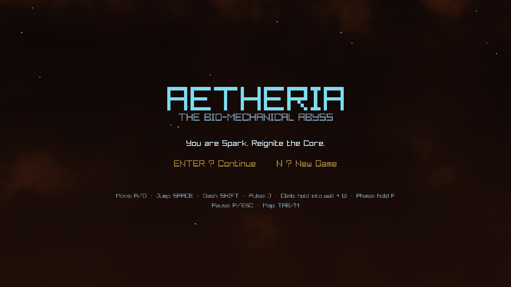
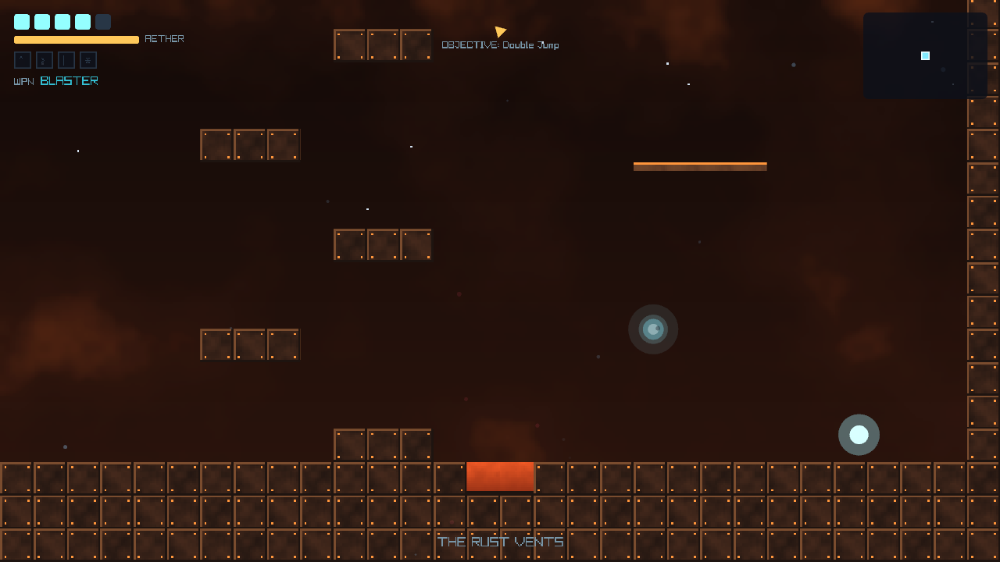
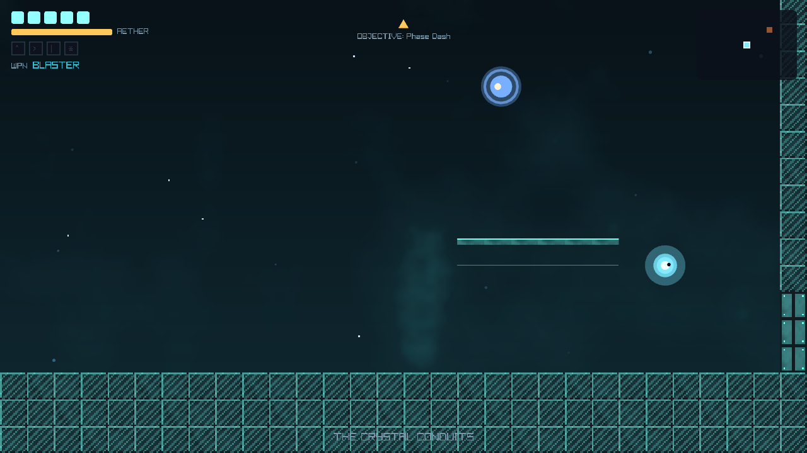
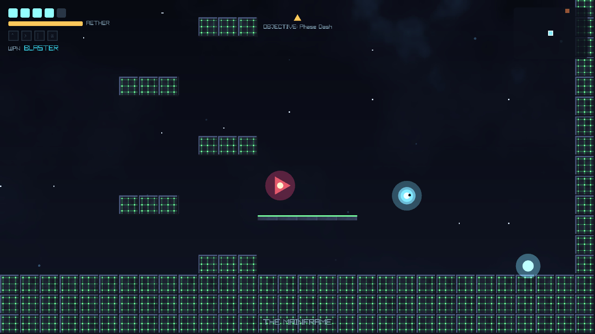

# Aetheria — Screenshots

All visuals below are generated **procedurally at runtime** — there are no image
assets in the repository. These were captured with the game's own render self-test
(`dotnet run --project src/Aetheria -- --rendertest --shots <dir> [--room N]`), which
boots the full draw path and writes PNGs.

## Title screen

*You are Spark. Reignite the Core.* — Continue a saved run or start a new one; the
controls legend sits below.

## The Rust Vents

The starting biome — molten oranges, riveted plating. Top-left: the AETHER bar,
ability slots and current weapon; top-right: the live minimap; centre: the objective
compass pointing to the next traversal ability.

## The Crystal Conduits

The mid-depth biome — teal, faceted crystal. A hover-drone drifts above the platforms.

## The Mainframe

The deepest biome, closing on the Core — green circuitry and darker steel, with a
hostile guardian on the platform.
